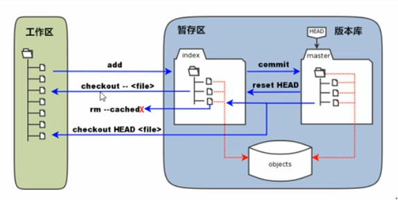
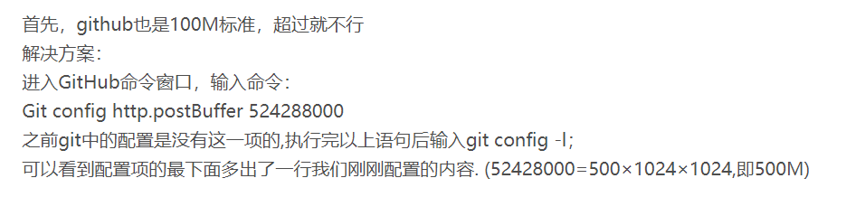

# git工作流程
    * 一般工作流程  
        1. 从远程仓库克隆git资源到本地仓库。
        2. 从本地仓库中checkout代码进行修改。
        3. 在提交前会将代码提交到暂存区。
        4. 提交修改，提交到本地仓库。（注意：本地仓库中会保存着各个之前修改的历史版本）
        5. 在之后如果需要共享代码，可以将代码push到远程仓库，以提供他人使用。

# git的安装使用
    * 下载：
        直接百度git下载即可（注意：不同的系统需要下载对应的版本）。
    * 安装：
        在完成下载之后，傻瓜式安装，一路下一步。
    * 介绍：
        * Git GUI：git的图形化界面。（特点：比较简陋）。
        * Git Bush：命令行使用。（通过linux命令操作）。
        * 安装图形化界面TortoiseGit(乌龟)：简化使用。
            1. 安装时使用OpenSSH。
            2. 配置指定git目录。
            3. 创建name和email。(由于分布式的原因)
                初始化name：git config --global user.name
                初始化email：git config --global user.email
                
            4. 可以安装乌龟的汉化包，然后在settings中修改language。
    * 目录介绍：
        .git:本地版本库。（这是一个隐藏文件夹）
        repo1：工作目录（工作区）包含.git文件夹，如果想向本地仓库添加文件，那么文件必须在此目录下。

    * 创建本地版本
        1. 首先创建repositorys文件夹，然后创建工作目录（repo1）
        2. 创建
            方式一：
                利用git自带的图形化界面创建，点击create new repository（会生成.git）
            方式二：
                使用git Bush（命令行的方式创建） 输入git init命令即可
            方式三：
                使用乌龟，点击Git在这里创建版本库按钮（不需要选中 制作纯版本库选项）

    * 使用：
        * 添加内容
            1. 使用乌龟点击添加按钮，可将文件添加到暂存区。
            2. 点击提交按钮，提交到mast。
            3. 需要写日志信息（注明提交的内容和修改的内容）。
            4. 提交成功后，会有绿色对勾。
        
        * 修改内容
            1. 直接在repo1目录下修改原来提交的文件（修改后，会呈现红色！）
            2. 正常情况需要先将其添加到暂存区，但是我们的图形化界面（乌龟）简化了这一步，只需要直接提交即可。
            3. 图形化界面中显示日志可以查看修改信息，然后可以选中文件点击比较版本差异按钮可以对比文件的修改。
        
        * 删除内容
            * 方式一
                1. 可以直接在repo1目录下将文件删除即可（此时本地仓库中的文件并没有真的被删除），如果误删的话
                可以使用还原按钮进行还原。
                2. 右键提交将缺失的文件选中提交到本地仓库，就真正的将文件删除。
            * 方式二
                1. 可以通过图形化界面的删除按钮删除（并没有真正的删除）也可以还原。
                2. 执行提交

            * 删除并保留副本按钮：
                点击这个按钮后，只会在repo1目录下为文件添加一个删除标记，但是本地版本库中依然存在。然后点击
                提交后，本地版本库中的文件会被删除，但是本地文件repo1目录下依然会保存此文件。
        
        * 将java工程添加到本地版本库
            1. 直接将文件放到工作目录repo1下，然后将文件添加到暂存区，最后提交到本地仓库
            2. 将不需要添加到本地仓库中的文件选中，点击删除并添加到忽略列表。可选择递归忽略（将选中目录下的
               所有文件忽略）生成的忽略文件（.gitigonore）放在文件/文件夹目录下（即工程目录下），需要将忽略
               文件添加到版本库中
            3. 点击提交到mast，标注日志信息

# git工作原理

# 远程仓库的使用
    * 使用github创建一个远程仓库
        1. 登录github创建一个账号。
        2. 登录后点击 Start a project 创建一个工程（Create new repository）
            注意：不需要选中 Initialize this repository with a README
    
    * 将内容推送到远程仓库
        1.概述
            1. 选择通信协议https或者ssh（后面会生成访问的服务器路径）
            2. 创建一个新的仓库推送到远程
                * git init                                                              初始化一个库
                * git add README.MD                                                     添加一个文件介绍
                * git commit -m"first commit"                                           提交到本地仓库
                * git remote add origin https://github.com/.../...（生成的服务器访问路径）将本地和远程进行关联
                * git push -u origin master                                             将文件推送到远程
            3. 将存在的本地仓库推送到远程
                * git remote add origin https://github.com/.../...（生成的服务器访问路径）
                * git push -u origin master 
    
        2. 使用ssh方式将本地仓库推送到远程（创建ssh密钥并在github上配置公钥）
            1. 生成密钥对命令：ssh-keygen -t rsa（生成的密钥存放在当前用户的文件夹下的.ssh文件夹下：
                              即c盘user目录下）
                注意：没有pub后缀的是私钥，有pub后缀的是公钥

            2. 将公钥传给github
                * 在github中用户管理处选择Settings，然后选择SSH and GPG keys 创建新的key（将公钥复制在这）

            3. 配置好后
                1. 使用命令将本地仓库推送到远程
                    * git remote add origin https://github.com/.../...（生成的服务器访问路径）
                    * git push -u origin master 
                2. 使用乌龟推送到远程
                    git同步 => 点击远端的管理 => 指定Putty密钥 =>点击推送

                    * 如何指定putty密钥
                        1. 选择网络 => 查看ssh客户端是否为git/usr/bin/ssh.exe(不是的话就指定为ssh.exe)
                        2. 将c盘用户下的.ssh下的密钥（私钥加密）添加即可
        
        3. 使用https的方式将本地仓库推送远程
            1. 利用乌龟的方式
            与ssh类似，但是这种方式在使用乌龟推送时不需要使用密钥，但是需要输入用户名和密码
            2. 利用命令行的方式
        
    * 克隆远程仓库到本地
        1. 在repositorys 下创建一个工作目录（如：clone-repos）
        2. 在github中选择Clone or download，并选择方式（https或者ssh）
            * 命令行方式
                git clone 路径
            * 乌龟方式
                点击克隆即可
    
    * 推送修改的文件及冲突解决
        乌龟方式思路:将修改的文件添加到远程仓库，然后在本地的工作区将远程仓库内容拉取下来，更新到本地仓库，可能
                    会出现冲突。
        
        冲突：由于两个文件内容版本不一致造成的，可能是不同的人对文件修改有不同内容造成的，也可能是两个分支之间
              同一个文件的内容不同产生的
                    
        冲突解决（手动解决）：将两个产生冲突的文件合并，并且删除git自动生成的符号

# git 分支
    * 创建合并分支
        使用乌龟创建：右键 => 创建分支/切换检出（切换分支）
    * 概念
        假设默认只有一个分支（master），我们可以添加一个分支（dev），这两个分支都独立向下运行（生成新的版本内容），
        但是我们可以对两个分支进行合并。（两个版本的内容会合并到一起），此时，两个分支可以继续向下运行，也可以继续
        合并。
        
        注意：当两个分支的操作不同的时候，两个分支切换后内容不同

    * 分支的合并与删除
        * 合并：两个分支（我们最后需要哪个分支，就必须切换到该分支）
                * 使用乌龟，点击合并即可。
                * 使用命令行，git merge <name>
        * 删除：
                * 使用乌龟，点击删除即可
                * 使用命令行，git branch -d <name>（删除本地分支），git push origin --delete <branchName>
                 （删除远程分支）

# 在IntelliJ IDEA中使用git
    * 如何将IDEA中的项目推送到git
        1. 配置命令
            file => settings => Version Control => git => 指定git安装路径（git.exe文件）

        2. 添加到本地仓库
            1. VBS => Import into Version Control => Create Git Repository =>在项目的上级目录（相当于git
            的工作目录）创建一个本地仓库即直接选中上级目录即可

            2. 查看上方工具条操作即可
                * 点击提交按钮（commit）提交到本地仓库： 选中需要保留的文件 => 输入日志信息 => 点击commit即可

            注意:out目录可以不需要提交
    
    * 使用IDEA克隆仓库并同步代码
        1. 推送到远程
            VCS => Git => push => Define Remote（指定名称，url）=> push
        2. 从远程仓库克隆内容
            * 在打开IDEA时选择 Check out from Version Control（选择git）=> 选择需要克隆的URl以及选择存放目录等
             => 点击clone => 一路下一步
            * 可以将远程代码拉取到本地

    * 在IDEA中使用git进行分支
        1. 创建分支
            VCS => Git => Branches => new Branch 
        2. 查看当前使用的分支
            VCS => Git => Branches => 查看哪个分支上有标签

    * 注意：创建远程仓库最好使用https，因为ssh在IDEA中不太好使用

# git 常用命令
    1. 初始化版本库：git init

    2. 将指定文件添加到暂存区：git add 文件名

    3. 将修改过和未提交的文件添加到暂存区：git add .

    4. 查看状态:git status
        * 红色表示在工作区
        * 绿色表示在暂存区
        * 没有任何显示表示在版本区

    5. 提交暂存区所有文件到版本区：git commit -m "xxx"

    6. 差异对比
        * 比较暂存区与工作区：git diff
        * 比较版本区与暂存区：git diff --cached
        * 比较版本区与工作区：git diff master

    7. 查看日志版本号
        * 显示从最近到最远的所有提交日志：git log           （完整版）
        * 显示每次提交的commit id：git reflog              （精简版）

    8. 版本回退、版本撤销、版本穿梭
        * 版本回退（回退一次提交）：git reset --hard HEAD^
        * 回到指定xxx的commit id 版本：git reset --hard xxx
        * 用版本库中的文件替换暂存区中的全部文件：git reset HEAD
        * 用暂存区指定文件替换工作区的指定文件（危险）：git checkout --x.txt
        * 用版本库中的文件替换暂存区和工作区的文件（危险）：git checkout HEAD x.txt
        * 从暂存区删除文件：git rm --cached x.txt

    9. 删除文件
        * 删除文件： git rm x.txt
        * 删除文件夹： git rm -r xxx

    10. 分支
        * 创建dev分支并ie换到dev分支：git checkout -b dev
        * 查看当前分支：git branch
        * 切换分支：git checkout 分支名
        * 合并dev分支到当前分支：git merge dev
        * 删除指定分支：git branch -d dev
        * 显示两个分支之间所有有差异的文件的详细差异：git diff branch1 branch2
        * 显示两个分支之间所有有差异的文件列表：git diff branch1 branch2 --stat
        * 显示指定文件的详细差异：git diff branch1 branch2 xxx 

    11. 将本地仓库与远程仓库建立联系：git remote add origin URL
    
    12. 将本地仓库推送到远程：git push -u origin master

    13. 将远程内容拉取：git pull origin master

    14. 克隆文件到本地：git clone URL
    
# Linux常见的命令
    * mkdir xxx ：新建文件夹

    * vi x.txt : 新建文件
        输入i 进入编辑模式
        ESC + : + wq 保存并退出
        ESC + : + q! 不保存并退出

    * cd 进入文件夹目录

    * cd.. 返回上一级目录

    * ls 列出当前文件夹中的所有文件

    * pwd 显示当前目录

    * cat x.txt 显示文件内容

    * clear 清屏

    * wget + 文件路径：下载文件 

# 注意问题
    1. 如果在推送代码后，电脑不能够记住github的用户名和密码，执行一下命令可以解决：
        git config --global credential.helper store

    2. 如果在使用git时，遇到文件太大不能够push到github中，那么可以通过以下方式解决

