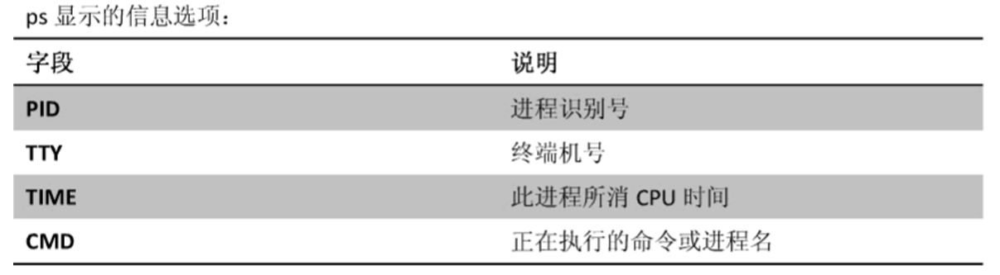

# Linux

## Linux的文本编辑器(vi和vim)

    1. 文本编辑器的模式
        <1> 一般模式

        <2> 编辑模式

        <3> 命令模式(只有在一般模式下才能实现命令模式，编辑模式是不行的)

    2. 文本编辑命令
        一般模式:
            a:                              当前光标前
            i:                              当前光标后
            o:                              当前光标行的下一行
            s:                              删除当前字符并进入编辑 
            S:                              删除整行并进入编辑
            R:                              进入替换模式，替换光标后内容，逐个替换

        编辑模式：
            dd :                            删除光标当前行
            dnd :                           删除n行 
            u :                             撤销上一步 
            x :                             删除一个字母Delete(删除光标所在位置的字母)
            X :                             删除一个字母Backspace(删除光标前面的字母)
            yy :                            复制光标当前行
            p :                             粘贴
            dw :                            删除一个词，词是以光标位置开始，以符号(如,)结尾
            yw :                            复制一个词
            shift+g :                       移动到页尾
            数字1+shift+g :                 移动到页头
            数字N+shift+g :                 移动到目标行
            shift+6 :                       移动到行头
            shift+4 :                       移动到行尾

        命令模式:
            : w                             保存
            : q                             退出
            : !                             强制执行
            : %s/old字符/new字符/g           批量替换
            / 要查找的词                     n 查找下一个，N 往上查找
            :set nu / :set nonu             显示行号 /关闭行号
            :noh                            取消高亮显示

##　常用命令集合

### 基本常用命令
     1. 新建
        * mkdir xxx ：新建文件夹
            -p 创建多个

        * vi x.txt : 新建文件
            输入i 进入编辑模式
            ESC + : + wq 保存并退出
            ESC + : + q! 不保存并退出

        * touch：创建文件

    2. cd命令

        * cd 进入文件夹目录

        * cd.. 返回上一级目录

        * cd~ 回到根目录

        * cd - 上下切换目录
    
    3. ls命令

        * ls 列出当前文件夹中的所有文件

        * ll 详细列出当前文件夹中的所有文件（包括权限等），是ls -l的简写。

        * ls -a 列出隐藏文件

        * 写入内容到xx.txt
            ls > xx.txt 表示将列出的内容写到xx.txt

            ls >> xx.txt 表示将列出的内容写到xx.txt(追加)

    4. 删除命令
        * rm -d(directory) 删除文件夹（不包含文件）

        * rm -r 删除文件夹（包含文件）

        * rm -rvf 递归删除所有目录内容，有提示

        * rm -rf  递归删除所有目录内容，没有提示

    5. 查看文件与查找文件
        * cat x.txt 显示文件内容
            * 参数-b 空格不显示行号
            * 参数-n 空格显示行号

        * more 查看看文件，会分页显示，空格下一页，b上一页
            * Enter:代表向下翻一行
            * q:代表立刻离开 more ，不再显示该文件内容。
            * Ctrl+F 向下滚动一屏
            * Ctrl+B 返回上一屏

        * less 同more类似，比more功能更多。
            * [down]：向下翻动一页；
            * [up] ：向上翻动一页；
            * /字串：向下搜寻『字串』的功能；
            * ?字串：向上搜寻『字串』的功能；
            * n ：重复前一个搜寻 (与 / 或 ? 有关！)
            * N ：反向的重复前一个搜寻 (与 / 或 ? 有关！)

        * tail 从尾部开始查看，比较适合查看日志
            * -f 跟随查看(即能查看即时修改的文件)
            * -n200  显示的行数，n可以省略。

        * locate  配合数据库查看文件位置。
            * locate /opt/*.conf
            * 运行前需要执行updatedb来更新文件索引

        * find  实际搜寻硬盘查询文件名称。
            * find+搜索路径+参数+搜索关键字


    6. grep命令（抓取）
        * grep 利用关键词搜索文件内容（进入文件之后，查找相关文字的信息）

        * grep -v 利用关键词反向搜索文件内容

            * 其中^表示以什么开头（如：^s以s开头），$表示以什么结尾（如：s$以s结尾）

        * 详细
            grep -n xx xx.txt 显示包含内容行的行号
            grep -v xx xx.txt 去掉包含内容的行，显示其他所有内容
            grep -v # xx.txt 去掉带#的行（去掉带注释的行） '#'
            grep -v ^# xx.txt 去掉只有注释的行
            grep #$ xx.txt ^x开头的行 x$以x结尾的行
            grep -i xx xx.txt 忽略大小写搜索

    7. echo 回显
        echo xxx > xxx.txt 写入（覆盖）

        echo xxx >> xxx.txt 追加（末尾）

    8. | 管道
        * 把一个命令的输出 通过管道连接 作为另一个命令的输入
          输出就是命令的结果，输入一般是一个命令的参数（cat xxx.txt 这个txt就是cat的输入）
          管道连接通过 | 建立。

        * ls -lh | grep xx.txt 抓取列出的信息到xx.txt

    9. cp 复制
        * cp  【复制的文件】 【到哪里】

            -r 递归复制整个文件夹
            -v 显示复制过程中文件的列表

    10. mv 移动
        * mv oldFileName newFileName :      重命名
        
        * mv /temp/movefile /targetFolder     移动文件(相当于剪切)

    11. cat 命令
        * cat  文件名   查看轻量级的文本文件

        * cat  文件1  文件2   连接显示多个文件

        * cat 文件1  文件2 > 文件3 合并为新文件

    12. 压缩/解压缩
        <1> 压缩
            * tar  -zcvf   XXX.tar.gz   n.txt   
                -c 创建一个新归档
                -v 显示详细信息
                -f 指定压缩后的文件名
                -z 通过 gzip 过滤归档

        <2> 解压缩
            * tar  -zxvf  XXX.tar.gz      
                -x从归档中解出文件
                -v 显示详细信息
                -f 指定解压前的文件名
                -z 通过 gzip 过滤归档

    13.sodu
         * sudo 以管理员权限执行命令。用户使用sudo的时候，会验证当前用户的密码，然后又5分钟的有效期，有效期内执行
           sudo不需要在再输入密码！
    
    14. 其它命令

        * pwd 显示当前路径

        * clear 清屏

        * wget + 文件路径：下载文件 

        * which 查看可执行文件（命令）的位置。

        * whereis 查看文件的位置。

        * ln 软连接，相当于创建快捷方式
            命令  ln –s 原文件或目录名 软链接名(如：ln -s /opt/aa.txt kuaijie)

        * history 查看历史命令

### 网络配置常用命令
    1. ifconfig  查看网络配置
        <1> 编辑配置文件：  vi  /etc/sysconfig/network-scripts/ifcfg-ens33

        <2> 配置文件详解：

            * 注意:如果需要网络有效，那么ONBOOT必须为yes
```
            DEVICE=eth0                         #接口名（设备,网卡）
            BOOTPROTO=none      
            IP的配置方法[none|static|bootp|dhcp]（引导时不使用协议|静态分配IP|BOOTP协议|DHCP协议） 
        BROADCAST=192.168.1.255                 #广播地址    
            HWADDR=00:0C:2x:6x:0x:xx            #MAC地址 
            IPADDR=192.168.1.23                 #IP地址
            NETMASK=255.255.255.0               # 网络掩码  
            NETWORK=192.168.1.0                 #网络地址 
            ONBOOT=yes                          #系统启动的时候网络接口是否有效（yes/no）
            TYPE=Ethernet                       #网络类型（通常是Ethemet）

```

### 进程类常用命令
    1. ps(process)
        <1> 字段说明



        <2> 命令解析
            
            * ps -aux | grep xxx ：查看某个进程的进程信息（查看进程的CPU占用率和内存占用率）
                ps -a :显示当前终端所有进程信息

                ps -u :以用户的格式显示进程信息

                ps -x : 显示后台进程运行的参数

            * ps -ef | grep xxx:以全格式显示当前所有的进程（查看进程的父进程ID）
                -e 显示所有进程。
                -f 全格式。

            * kill pid   通过唯一标识pid杀死进程
                -9 强行杀死进程

            * killall  name   通过进程名称杀死进程

    2. 服务(service)
        <1> 命令(CentOS6使用service，CentOS7用systemctl )
            1) CentOS6之service
                * 命令
                    service  服务名 start     
                    service  服务名 stop
                    service  服务名 restart
                    service  服务名 reload
                    service  服务名 status
                
                * 查看服务的方法  /etc/init.d/服务名  

                * 通过chkconfig 命令设置自启动
                    查看服务 chkconfig    --list|grep  xxx
                    chkconfig   --level  5   服务名   on
                
                * 查看默认运行级别：  vi /etc/inittab

            2) CentOS7之systemctl
                * 命令
                    systemctl start 服务名(xxxx.service)
                    systemctl restart 服务名(xxxx.service)
                    systemctl stop 服务名(xxxx.service)
                    systemctl reload 服务名(xxxx.service)
                    systemctl status 服务名(xxxx.service)

                * 查看服务的方法 /usr/lib/systemd/system

                * 查看服务的命令
                    systemctl list-unit-files
                    systemctl --type service
                * 通过systemctl 命令设置自启动
                    自启动systemctl enable service_name
                    不自启动systemctl disable service_name

    3. netstat：查看系统的网络情况
        -an  按一定顺序排列输出
        -p  显示哪个进程在调用
        netstat  –anp|grep  8080 查看占用8080端口的进程

### 用户操作命令
    1. 用户组
            每个用户都有一个初始组，可以有零个或者多个附加组。用户组的作用，是为了方便权限控制。（附加组
            就是为了给用户附加别的权限）
            当创建用户的时候，系统会创建一个跟用户名同名的组。
            文件属性：所属用户、所属用户组

    2. 用户切换
        su xx 用户切换
        su - xx 用户切换，并回到家目录
        1，su 2，su - 切换到root用户
        exit 退出当前用户，返回上一个用户（从哪个用户切换过来的）如果没有上一个用户，直接退出终端
    3. 用户删除
        userdel xx
        userdel -r xx 删除家目录
        userdel -f xx 强制删除，即使用户正在登陆系统
    4. 用户组管理
        groupadd xx 添加
        cat /etc/group 确认组是否被添加成功
        goupmod -n xx newxx 改名
        groupdel xx 删除

    5. Linux中的ID
        文件id uid（用户id） gid（用户组id）
        ls -i
        id 查看当前用户的uid和gid
        id xx 查看xx用户的uid和gid

    6. 查看用户信息
        id
        whoami 当前登录用户
        who 当前所有登录用户罗列出来
    
    7. 修改用户信息（usermod）（某些需要重新登录生效）
        usermod -g xxgroup xxuser 修改初始组（基本不去修改）
        usermod -G xxgroup,xxgroup xxuser 修改附加组
        usermod -s /bin/bash xxuser 修改shell

    8. 用户权限说明
        * - --- --- ---     共10个字符，第一个字符为-表示二进制文件，为d表示文件夹，l表示软连接文件

            u   g   o       u(user，用户权限)  g（group，用户组权限） o（other权限）

        * 权限
            r 表示可读  w表示可写  x表示可执行

    9. 权限修改
        * 只有文件所有者和超管可以修改文件的权限。使用下列命令修改权限
            chmod (change the permissions mode of file)
            
            * 格式一
                chmod [ugoa][+-=][rwx] 文件或者目录
                其中u表示user，g表示用户组，o表示其它访问者，+表示增加权限，-表示减少权限，=表示设置权限为

                如：chmod u+w,g+x xx.txt ：表示为user用户增加xx.txt的可执行权限

        * chmod 修改文件权限
            chown(change owner)修改拥有者（所属者）
            chgrp(change group)修改拥有组（所属组）
            文件是所属者和所属组发生改变，用户对文件的权限也发生改变
            chown newuser 文件/文件夹 修改文件或者文件夹的拥有者
            chgrp newgroupname 文件/文件夹 修改文件或者文件夹的所属组
            -R 递归修改所有子文件  

        * 注意：一个文件（文件夹）改名、删除的权限是由它所在目录的权限控制的，而不是自身的权限控制。因为它自
                身的权限只控制它自身的内容。

        * 权限表

   

    10. 用户管理相关命令
        * 第一步：添加用户名
          useradd xx （-m：创建家目录 和 -g：指定所在的组 选项）
        * 第二步：设置密码(不设置用户名的用户是不能使用的)（注意是passwd不是password）
          passwd xx （sudo passwd xx）

### 知识点

    1. 存放命令位置的区别
        /bin binary，二进制文件，普通命令
        /sbin system binary,系统二进制文件,需要有系统权
        /usr/bin 用户安装的应用程序
        /usr/sbin 超管安装的应用程序

    2. 为什么locate查找比find查找要快
        * 这是因为locate有一个索引库，查找时会去索引库查找。locate的缺点就是有查找时延，更新索引库不及时，可以
          使用updatedb更新

## rpm与yum
    1. rpm
        <1> 查询已安装的rpm列表 rpm  –qa|grep xx

        <2> 安装rpm
            rpm –ivh rpm包名
            -i 安装 install
            -v 查看信息
            -h 查看进度条

        <3> 卸载rpm
            rpm -e RPM软件包

    2. yum
        <1> yum list|grep xx软件列表

        <2> yum install xxx  下载安装


